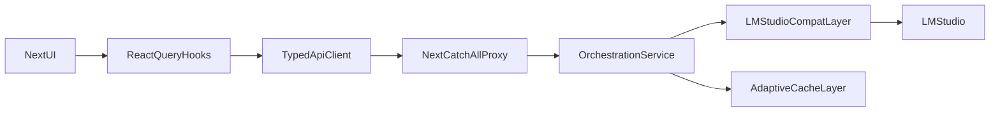

# Migration-First Orchestration Plan

## Goal

Move from monolithic page fetch orchestration to a modular, cache-aware data layer, while preparing a dedicated orchestration service boundary for future Bun/Go evolution.

## Current Constraints (from code)

- `src/app/page.tsx` currently owns many endpoint-specific `fetch*` callbacks and a global `setInterval` polling loop.
- `src/lib/api.ts` already provides a broad API surface but is not the single source for all dashboard reads/writes.
- `src/app/api/proxy/[...path]/route.ts` is the transport choke point and supports path rewriting for `/v1/*` and `/api/proxy/*`.
- `mini-services/proxy-bridge/index.ts` remains a large router/handler monolith and currently contains both LM Studio compatibility and orchestration concerns.

## Target Architecture (Migration-First)

## Phase 1: Split `page.tsx` Fetch Orchestration

- Create focused hooks in `src/hooks/` by domain, each wrapping `src/lib/api.ts`:
  - `useSystemStatusData` (status/tools/models)
  - `useObservabilityData` (health/vram/confidence/lineage/narrative)
  - `useKnowledgeData` (knowledge list/query/index/fetch)
  - `useGatewayData` (presets, gateway log/search, chat tests)
- Replace direct `fetch(...)` calls in `[src/app/page.tsx](src/app/page.tsx)` with hook usage.
- Keep UI behavior stable while moving fetch state, retries, and stale logic into hooks.

## Phase 2: Smart Polling + Caching (Chosen Strategy)

- Introduce React Query-backed server-state orchestration in hooks:
  - stale-time per domain (status fast, observability medium, static config slow)
  - interval polling only for volatile domains
  - focus-aware refetching and retry backoff
- Add request deduping + cache invalidation on mutating actions (settings save, model load/unload, reconnect).
- Add a polling policy map in one file (single source of truth for intervals and staleness).

## Phase 3: Orchestration Service Boundary (Bun-first, Go-ready)

- Define orchestration interfaces/contracts in the proxy bridge for:
  - context building
  - retrieval/rerank policy
  - tool-routing policy
  - quality signal emission
- Extract orchestration-related routing from `[mini-services/proxy-bridge/index.ts](mini-services/proxy-bridge/index.ts)` into modular service files under `mini-services/proxy-bridge/` (or subfolders).
- Keep LM Studio compatibility in a dedicated adapter layer; do not mix transport and orchestration policy.
- Ensure boundary is transport-neutral so it can be reimplemented in Go without frontend contract changes.

## Phase 4: Runtime Quality + Observability Improvements

- Add endpoint-level latency/error counters for each dashboard domain.
- Add explicit fallback states (degraded but renderable widgets) in page-level UI.
- Normalize “current narrative” behavior to avoid noisy 404-like UX states.

## Phase 5: Migration Track (Bun -> Go Decision Gate)

- Benchmark Bun orchestration module after Phase 3 using realistic coding-agent workloads.
- Gate criteria for moving orchestration core to Go:
  - sustained concurrency needs
  - p95 latency under load
  - operational complexity and deployment targets
- If criteria met, port orchestration service only; keep Next proxy and LM Studio compatibility contracts stable.

## Files to Change First

- `[src/app/page.tsx](src/app/page.tsx)`
- `[src/lib/api.ts](src/lib/api.ts)`
- `[src/hooks/](src/hooks/)`
- `[src/app/api/proxy/[...path]/route.ts](src/app/api/proxy/[...path]/route.ts)`
- `[mini-services/proxy-bridge/index.ts](mini-services/proxy-bridge/index.ts)`

## Acceptance Criteria

- `page.tsx` no longer contains the large orchestration polling block.
- Data fetching and cache policy live in reusable hooks/services.
- Polling volume is reduced and adaptive per domain.
- API contracts remain OpenAI-compatible and dashboard behavior is stable.
- Orchestration logic is modularized behind clear interfaces, ready for Bun/Go swap-in later.

Based on your migration plan and the research on Bun vs Go performance characteristics, here are additional tasks I recommend adding to address inference performance bottlenecks:
Recommended Additional Tasks
1. Streaming Response Optimization
Add a task to optimize how streaming responses flow through your architecture. Research shows Bun can have significantly higher tail latency (p99 ~974ms vs Go's ~114ms) under load , which directly impacts LLM token streaming perceived performance.

- id: streaming-latency-optimization
  content: Implement chunked streaming middleware with backpressure handling between proxy-bridge and Next.js; add buffer pooling for SSE streams to reduce GC pressure in Bun.
  status: pending

2. LM Studio Connection Pooling & Queue Management
LM Studio now supports parallel requests via continuous batching , but your proxy-bridge needs to manage this properly to avoid overwhelming it.

- id: lm-studio-connection-mgmt
  content: Add connection pooling and request queueing for LM Studio with configurable Max Concurrent Predictions; implement circuit breaker for model crash recovery.
  status: pending

3. Request Coalescing for Embeddings/Rerank
Given LM Studio's embedding stability issues with concurrent requests , add deduplication and batching:

- id: embedding-request-coalescing
  content: Implement request coalescing for embedding/rerank calls to reduce LM Studio load; add jittered retry with exponential backoff for embedding failures.
  status: pending

4. Memory Pressure Monitoring
Bun's memory usage scales significantly with concurrent async tasks (480MB+ at 1M promises) , which matters for long-running inference orchestration:

- id: memory-pressure-guards
  content: Add heap memory monitoring in proxy-bridge with graceful degradation when approaching limits; implement streaming response cleanup to prevent memory leaks.
  status: pending

5. Alternative Inference Backend Prep
Since you mentioned inference performance issues, prepare for potential LM Studio alternatives:

- id: inference-backend-abstraction
  content: Create provider-agnostic inference interface in proxy-bridge to support swapping LM Studio for vLLM/Ollama without frontend changes; implement feature detection for backend capabilities.
  status: pending

6. Go Orchestration Fast-Track
Given Bun's ~20x slower performance on small async tasks  and your inference concerns, consider accelerating the Go migration decision:

- id: go-orchestration-spike
  content: Build minimal Go orchestration service spike focusing on streaming proxy performance; benchmark against Bun implementation with realistic token streaming workloads.
  status: pending